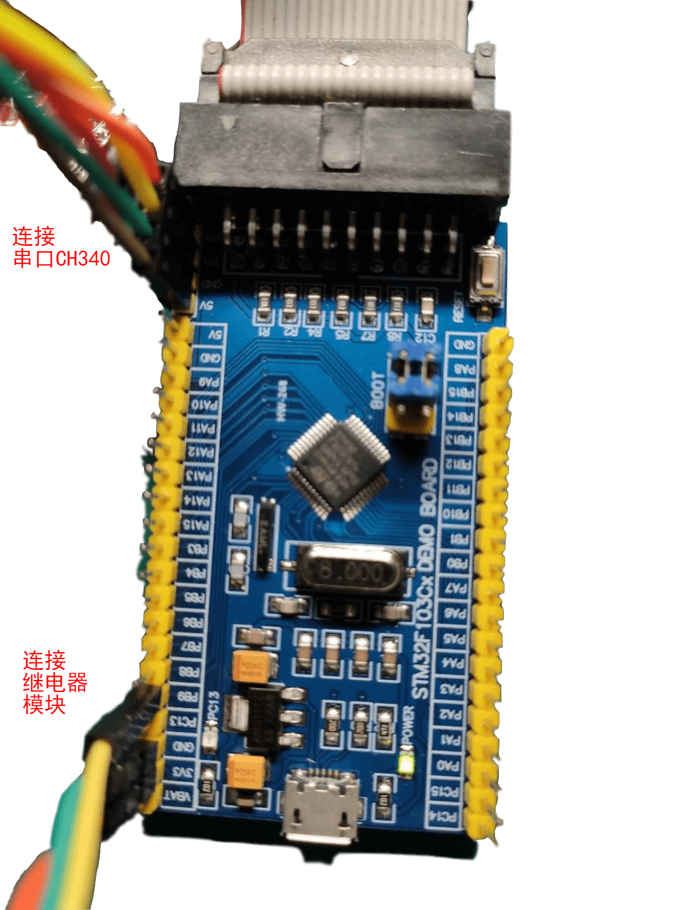
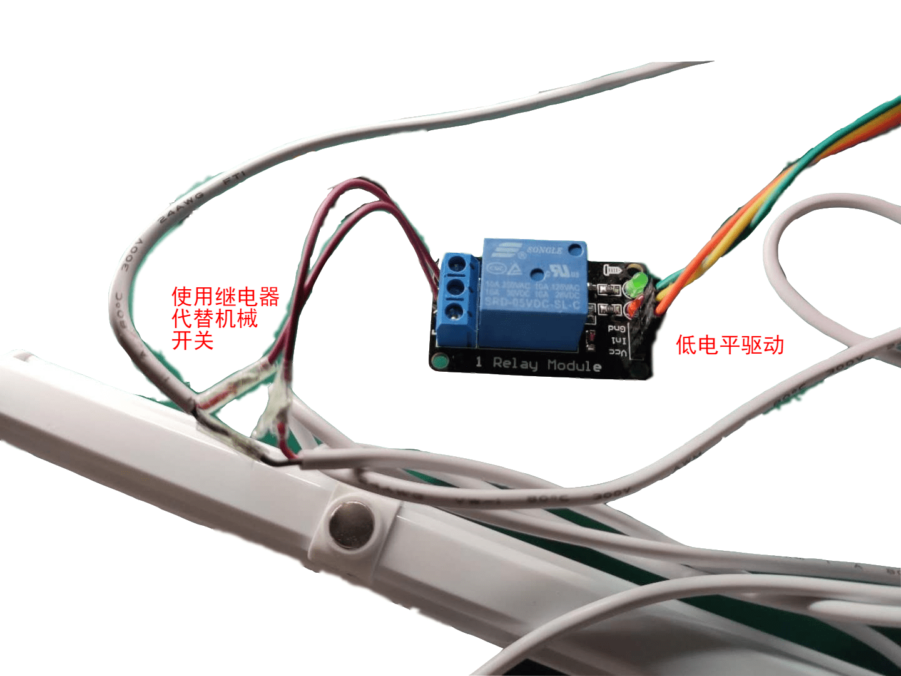
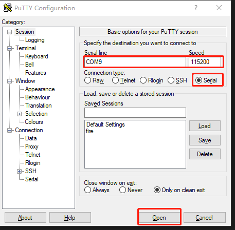
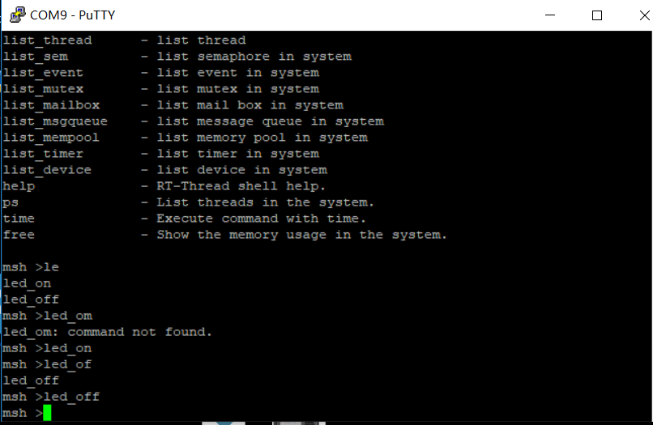

# 本项目描述
使用stm32，基于[RT-Thread系统](https://github.com/RT-Thread/rt-thread)，使用串口控制led灯带的开关

# 连线图

# 使用指南

下载[putty](https://www.chiark.greenend.org.uk/~sgtatham/putty/latest.html)

双击打开过putty后，如图设置**正确的串口号**和**115200**的波特率后，点击**open**

在命令行输入命令控制led灯带的开关

+ led_on 打开led灯带的开关
+ led_off 关闭led灯带的开关

下载固件到stm32可以选择通过**jtag**或者**串口**，通过**jtag**下载可以直接在keli的工具栏中点击下载按钮

# 效果图

